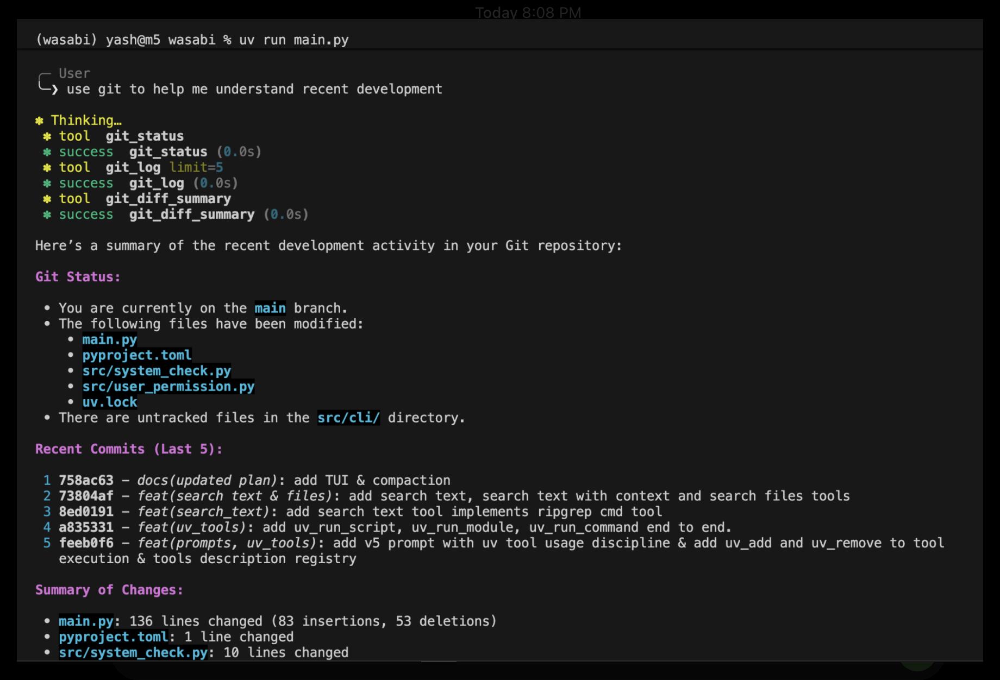

# Wasabi

  

## About

Wasabi is a Python-first terminal coding agent I built to understand the engineering behind **agentic systems, secure agent execution, code intelligence, and efficient context management**.

The project is primarily a hands-on exploration of how coding agents work internally: how an LLM reasons through multi-step tool workflows, interacts with a real repository, executes actions under controlled permissions, understands source code structurally, and remains observable and testable.

## Engineering Focus

Wasabi explores:

- **Agentic workflows** — designing tools that an LLM can combine and reason over to complete multi-step software engineering tasks.
- **Controlled agent execution** — giving an agent useful filesystem, Git, dependency, search, and execution capabilities without unrestricted access to the host system.
- **Agent security** — project-root isolation, user permissions for sensitive operations, prompt-injection checks, execution restrictions, and protection against indirect attempts to bypass denied actions.
- **Code intelligence** — using Tree-sitter, AST-based code analysis, symbol indexing, dependency graphs, and LSP integration to help the agent understand code beyond raw text.
- **Efficient context management** — precise reads, surgical edits, persistent project context, and context compaction to reduce unnecessary token usage and API cost.
- **Monitoring and evaluation** — understanding how to observe agent actions, trace tool usage, evaluate task outcomes, measure failures, and test agent behavior under normal and adversarial conditions.
- **Agent security research** — studying vulnerabilities that real-world agentic products face, including prompt injection, tool misuse, excessive agency, indirect execution bypasses, malicious repository content, unsafe code execution, and confused-deputy-style behavior.

## Core Principle

Wasabi is built around one central question:

- **How can an AI agent be given enough capability to perform useful engineering work while keeping its execution controlled, observable, secure, and economical?**

- The goal of the project is not to build the largest coding-agent framework. It is to directly implement and understand the systems behind practical agentic software: **tool orchestration, security boundaries, code intelligence, context efficiency, monitoring, secure execution of untrusted code and agent evaluation.**j